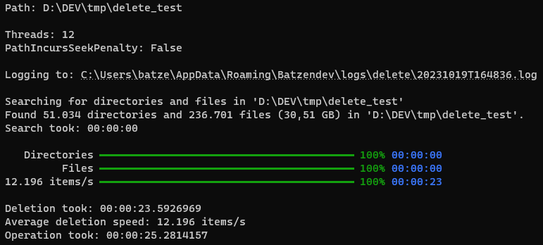

### Description

Just a suite of tools.
Currently included:

- Text-Finder: Search and replace text in files
- File-Finder: Search for files and directories
- Copy: Copy directories and files (via CLI, UI or Explorer extension)
- Delete: Delete directories and files (via CLI, UI or Explorer extension)

All features are designed for performance.

Binaries for the tool can be found at [Chocolatey](https://chocolatey.org/packages/Batzendev.Tools) or [GitHub](https://github.com/batzen/Batzendev.Tools/releases).

If you are using my little tool and encounter any issues or have ideas for improvements feel free to [provide feedback](https://github.com/batzen/Batzendev.Tools).

### Installation

To install simply call `choco install Batzendev.Tools` (given you have Chocolatey installed).

To [install Chocolatey](https://chocolatey.org/install) you can use

`Set-ExecutionPolicy Bypass -Scope Process -Force; [System.Net.ServicePointManager]::SecurityProtocol = [System.Net.ServicePointManager]::SecurityProtocol -bor 3072; iex ((New-Object System.Net.WebClient).DownloadString('https://community.chocolatey.org/install.ps1'))`

from an admnistrative PowerShell console.

### Text-Finder

Lets you search and replace text in files.

### File-Finder

Lets you find files and directories.

### Disk-Usage

Lets you analyze disk usage.

### Copy

### Delete

### Remarks

None of the features uses any kind of caching or indexing.

### License

MIT License

Copyright (c) 2009 - 2021 Bastian Schmidt

Permission is hereby granted, free of charge, to any person obtaining a copy
of this software and associated documentation files (the "Software"), to deal
in the Software without restriction, including without limitation the rights
to use, copy, modify, merge, publish, distribute, sublicense, and/or sell
copies of the Software, and to permit persons to whom the Software is
furnished to do so, subject to the following conditions:

The above copyright notice and this permission notice shall be included in all
copies or substantial portions of the Software.

THE SOFTWARE IS PROVIDED "AS IS", WITHOUT WARRANTY OF ANY KIND, EXPRESS OR
IMPLIED, INCLUDING BUT NOT LIMITED TO THE WARRANTIES OF MERCHANTABILITY,
FITNESS FOR A PARTICULAR PURPOSE AND NONINFRINGEMENT. IN NO EVENT SHALL THE
AUTHORS OR COPYRIGHT HOLDERS BE LIABLE FOR ANY CLAIM, DAMAGES OR OTHER
LIABILITY, WHETHER IN AN ACTION OF CONTRACT, TORT OR OTHERWISE, ARISING FROM,
OUT OF OR IN CONNECTION WITH THE SOFTWARE OR THE USE OR OTHER DEALINGS IN THE
SOFTWARE.
